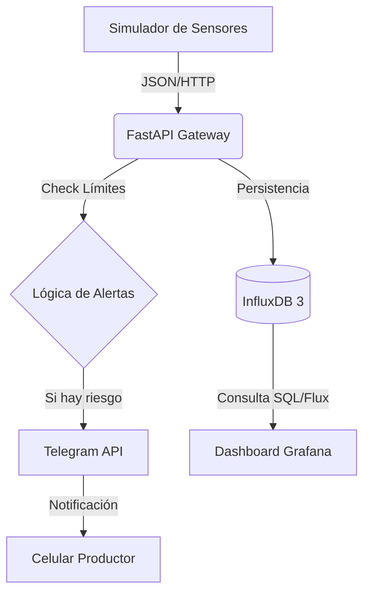

# Guardián silo bolsa

## Descripción

Guardián Silo Bolsa es un sistema para el monitoreo preventivo de granos. Implementa una arquitectura de microservicios para la ingesta de datos en tiempo real, almacenamiento en series temporales y un sistema inteligente de alertas.


## Authors

- [@alejandro-decaroli](https://github.com/alejandro-decaroli)


## Arquitectura 

El sistema está diseñado bajo una arquitectura de microservicios contenidizados, priorizando la escalabilidad y el manejo eficiente de datos masivos.

    FastAPI (Backend): Elegido por su naturaleza asíncrona, ideal para recibir múltiples peticiones de sensores simultáneamente sin bloquear el hilo principal. La validación con Pydantic garantiza la integridad de los datos antes de persistirlos.

    InfluxDB 3 (Time-Series DB): A diferencia de una base SQL tradicional, InfluxDB está optimizada para series temporales. Esto permite consultas rápidas sobre millones de puntos de datos y una gestión eficiente de la retención de datos históricos de los silos.

    Grafana (Observabilidad): Se utiliza para transformar datos crudos en información visual accionable, permitiendo identificar tendencias de calentamiento antes de que el grano se eche a perder.

    Telegram Bot (Alerting): Implementado para cerrar la brecha entre el sistema y el usuario final, enviando notificaciones push críticas directamente al celular del productor.



## Features

- Simulación Basada en Estados: El simulador no solo tira números aleatorios, sino que recrea escenarios reales (Normal, Calentamiento, Falla de Sensor).

- Alertas Inteligentes: Sistema de notificación vía Telegram con control de intervalos para evitar spam.

- Persistencia Dual: Almacenamiento en base de datos de series temporales (InfluxDB) y respaldo local en CSV.


## Installation

Es necesario tener instalado Poetry para instalar las dependencias y correr el proyecto, para la instalación de Poetry sigan los pasos de su página web: [Instalar Poetry](https://python-poetry.org/docs/#installation)

También tienen que tener instalado Docker y Docker Compose para correr los contenedores, eligan su método de instalación según sus sistema operativo: [Docker manual](https://docs.docker.com/manuals/)

Para que las alertas lleguen a Telegram tienen que tener configurado un bot, para esto sigan los pasos de configuracion del bot de telegram, de ahi podran obtener las variables de ambiente de TELEGRAM_BOT_TOKEN y TELEGRAM_CHAT_ID que copiaran y pegaran en el archivo .env.

🚀 Configuración del Bot de Telegram

    Hablá con @BotFather en Telegram y creá un nuevo bot para obtener tu API Token.

    Obtené tu Chat ID enviando un mensaje a tu nuevo bot y consultando https://api.telegram.org/bot<TU_TOKEN>/getUpdates.

    
## Environment Variables

Para correr este proyecto es necesario tener las siguientes variables de ambiente declaradas en un archivo .env, (las variables de INFLUX TOKEN y de TELEGRAM se explican como obtenerlas en la sección de "Run Locally")


```env
INFLUX_TOKEN=
INFLUX_HOST=http://influxdb3-core:8181
INFLUX_DATABASE=guardian_db
API_URL=http://guardian_api:8000/ingest
CSV_PATH=backups/data_backup.csv
TELEGRAM_BOT_TOKEN=
TELEGRAM_CHAT_ID=
```


## Run Locally

Clonar el proyecto

```bash
  git clone https://github.com/alejandro-decaroli/guardian_silo_bolsa.git
```

Ir a la carpeta del proyecto

```bash
  cd guardian_silo_bolsa
```

Instalar dependencias

```bash
  poetry install
```

Utilizar el ambiente virtual creado por Poetry:

```bash 
eval $(poetry env activate)
```


Pasos para correr los contenedores:

**1) Levantar la instancia de Influxdb3:** 
```bash
docker compose up -d influxdb3-core
```

**2) Obtener el token de Influxdb:** Luego de levantar la instancia de Influxdb3, necesitamos obtener un token de autenticación para que nos permita hacer operaciones en la base de datos, primero debemos acceder a la terminal de Influxdb3: 
```bash
docker exec -it influxdb3 /bin/bash
``` 

Luego correr el comando:
```bash
influxdb3 create token --admin
```
Este último comando nos devolvera un token, deben copiarlo y pegarlo en el archivo .env en la variable INFLUX_TOKEN.

**3) Crear la base de datos:** 
```bash
influxdb3 create database guardian_db --token (acá escriben el token que les devolvio influxdb3)
```

(Una vez creada la base de datos pueden cerrar la terminal de influxdb3)

**4) Levantar la API:** 
```bash
docker compose up -d guardian_api
```

**5) Levantar el simulador:** 
```bash
docker compose up -d simulator
```

**6) Levantar Grafana:** 
```bash
docker compose up -d grafana
```

**7) (Opcional) Levantar el explorador de Influxdb3:** 
```bash
docker compose up -d influxdb3-explorer
```

Con todos los contenedores funcionando, pueden ir a http://localhost:3000 para visualizar los datos en Grafana. El usuario y la contraseña son: admin.
Para crear los dashboards de grafana se recomienda que vean los respectivos tutoriales, los screenshot de este proyecto son solo a modo de ilustración.\
Si levantaron el explorador de influxdb3 pueden ir a  http://localhost:8888
Para explorar datos con el explorador de influxdb3 sigan las instrucciones según su documentación.

## Tech Stack

**Base de datos:** [Influxdb3 Core](https://www.influxdata.com/products/influxdb/)\
**Backend:** [Fastapi](https://fastapi.tiangolo.com/)\
**Lenguaje:** [Python](https://www.python.org/)\
**Package manager:** [Poetry](https://python-poetry.org/)\
**Visualización:** [Grafana](https://grafana.com/)

## License

[MIT](https://github.com/alejandro-decaroli/guardian_silo_bolsa/blob/main/LICENSE)


## Screenshots


