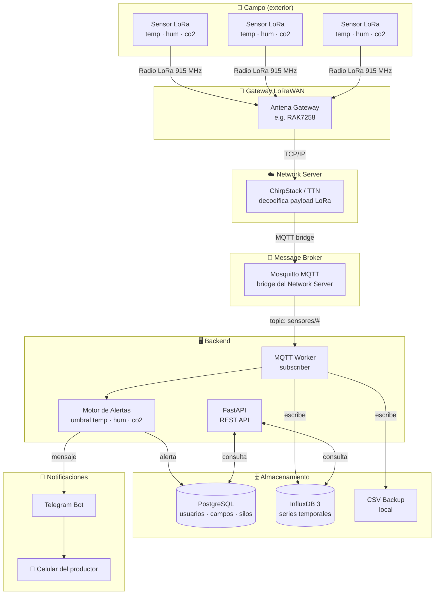
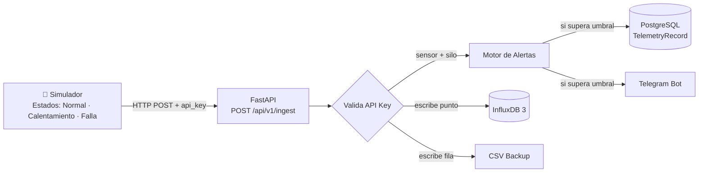

# 🌾 Guardián Silobolsa

Sistema de monitoreo preventivo en tiempo real para granos almacenados en silobolsas. Registra temperatura, humedad y CO₂ de forma continua y alerta al productor vía Telegram ante cualquier riesgo de fermentación o rotura.

---

## ¿De qué va el proyecto?

Los silobolsas son bolsas herméticas de plástico que los productores agropecuarios usan para almacenar granos tras la cosecha. Si la bolsa se rompe (por vandalismo, animales o desgaste) o si el grano entra con demasiada humedad, comienza un proceso de fermentación que puede destruir toda la cosecha en cuestión de días. Las pérdidas económicas son enormes.

**Guardián Silobolsa** monitorea 24/7 el interior de cada silobolsa a través de sensores IoT, registra las lecturas en una base de datos de series temporales y, si los valores de temperatura, humedad o CO₂ superan los umbrales seguros, notifica al dueño directamente en su celular por Telegram.

### ¿Qué puede hacer el sistema?

- Registrar múltiples **campos**, cada uno con sus **silobolsas** y **sensores**
- Recibir telemetría en tiempo real desde sensores físicos (o el simulador incluido)
- Guardar las lecturas en **InfluxDB 3** para consulta histórica y gráficos
- Generar y almacenar **alertas** automáticamente cuando se superan los umbrales
- Notificar al productor por **Telegram** con detalle del silo afectado
- Mantener un respaldo local de todas las lecturas en **CSV**
- Exponer toda la información a través de una **REST API** lista para conectar un frontend

---

## Flujo de datos

### Flujo real (producción con hardware IoT)

En un despliegue real, los sensores físicos transmiten por **LoRaWAN**, una tecnología de radio de largo alcance y bajo consumo ideal para el campo abierto. El flujo completo es el siguiente:


```mermaid
graph TD
    subgraph Campo ["🌾 Campo (exterior)"]
        S1[Sensor LoRa\ntemp · hum · co2]
        S2[Sensor LoRa\ntemp · hum · co2]
        S3[Sensor LoRa\ntemp · hum · co2]
    end

    subgraph Gateway ["📡 Gateway LoRaWAN"]
        GW[Antena Gateway\ne.g. RAK7258]
    end

    subgraph LNS ["☁️ Network Server"]
        NS[ChirpStack / TTN\ndecodifica payload LoRa]
    end

    subgraph Broker ["🔀 Message Broker"]
        MQTT[Mosquitto MQTT\nbridge del Network Server]
    end

    subgraph Backend ["🖥️ Backend"]
        API[FastAPI\nREST API]
        WORKER[MQTT Worker\nsubscriber]
        ALERT[Motor de Alertas\numbral temp · hum · co2]
    end

    subgraph Storage ["🗄️ Almacenamiento"]
        PG[(PostgreSQL\nusuarios · campos · silos)]
        IF[(InfluxDB 3\nseries temporales)]
        CSV[CSV Backup\nlocal]
    end

    subgraph Notify ["📲 Notificaciones"]
        TG[Telegram Bot]
        PHONE[📱 Celular del productor]
    end

    S1 & S2 & S3 -->|Radio LoRa 915 MHz| GW
    GW -->|TCP/IP| NS
    NS -->|MQTT bridge| MQTT
    MQTT -->|topic: sensores/#| WORKER
    WORKER --> ALERT
    WORKER -->|escribe| IF
    WORKER -->|escribe| CSV
    ALERT -->|alerta| PG
    ALERT -->|mensaje| TG
    TG --> PHONE
    API <-->|consulta| PG
    API <-->|consulta| IF
```

### Flujo del simulador (este repositorio)

Para demostración, el simulador reemplaza el hardware físico llamando directamente al endpoint HTTP de ingesta. El resto del pipeline (alertas, InfluxDB, Telegram, CSV) funciona exactamente igual.


```mermaid
graph LR
    SIM[🤖 Simulador\nEstados: Normal · Calentamiento · Falla]
    API[FastAPI\nPOST /api/v1/ingest]
    AUTH{Valida API Key}
    ALERT[Motor de Alertas]
    IF[(InfluxDB 3)]
    CSV[CSV Backup]
    PG[(PostgreSQL\nTelemetryRecord)]
    TG[Telegram Bot]

    SIM -->|HTTP POST + api_key| API
    API --> AUTH
    AUTH -->|sensor + silo| ALERT
    ALERT -->|si supera umbral| PG
    ALERT -->|si supera umbral| TG
    AUTH -->|escribe punto| IF
    AUTH -->|escribe fila| CSV
```

### Estados del simulador

El simulador no genera datos aleatorios planos. Recrea tres escenarios reales:

| Estado | Descripción |
|---|---|
| `NORMAL` | Valores estables con variación mínima (20°C · 10% hum · 350 ppm CO₂) |
| `CALENTAMIENTO` | Incremento progresivo correlacionado: la humedad sube → el CO₂ escala → la temperatura sigue |
| `FALLA_SENSOR` | Los tres valores pasan a `null`, simulando un sensor desconectado |

---

## Stack tecnológico

| Componente | Tecnología | Rol |
|---|---|---|
| Backend | FastAPI + Python 3.14 | REST API, lógica de negocio |
| Base de datos relacional | PostgreSQL 17 | Usuarios, campos, silos, alertas |
| Base de datos de series temporales | InfluxDB 3 Core | Lecturas de sensores |
| ORM | SQLModel + SQLAlchemy | Modelos y queries relacionales |
| Autenticación | JWT (PyJWT) + Argon2 | Tokens en cookies httpOnly |
| Notificaciones | Telegram Bot API | Alertas al productor |
| Package manager | Poetry | Gestión de dependencias |
| Contenedores | Docker + Docker Compose | Despliegue local reproducible |

---

## Instalación y uso

### Prerequisitos

- [Docker](https://docs.docker.com/manuals/) y Docker Compose instalados
- Una cuenta de Telegram para recibir alertas (opcional pero recomendado)

### 1. Clonar el repositorio

```bash
git clone https://github.com/alejandro-decaroli/guardian_silo_bolsa.git
cd guardian_silo_bolsa
```

### 2. Configurar variables de entorno

Copiar el archivo de ejemplo y completarlo:

```bash
cp .env.example .env
```

```env
# --- INFLUXDB ---
INFLUX_TOKEN=tu_token_aqui          # Se obtiene en el paso 4
INFLUX_HOST=http://influxdb3-core:8181
INFLUX_DATABASE=guardian_db

# --- API & BACKEND ---
INGEST_API_URL=http://guardian_api:8000/api/v1/ingest
HANDSHAKE_API_URL=http://guardian_api:8000/api/v1/sensors/handshake
BACKEND_PORT=8000
BACKEND_HOST=0.0.0.0

# --- POSTGRESQL ---
POSTGRES_USER=postgres
POSTGRES_PASSWORD=password_seguro
POSTGRES_DB=guardian_db
POSTGRES_HOST=postgres_guardian
POSTGRES_PORT=5432

# --- SEGURIDAD ---
SECRET_KEY=genera_una_clave_larga_y_aleatoria_aqui
ALGORITHM=HS256
ACCESS_TOKEN_EXPIRE_MINUTES=60

# --- TELEGRAM (opcional) ---
TELEGRAM_BOT_TOKEN=token_del_bot
TELEGRAM_CHAT_ID=tu_chat_id

# --- OTROS ---
CSV_PATH=backups/data_backup.csv
```

#### Configurar el bot de Telegram (opcional)

Si querés recibir alertas en tu celular:

1. Hablá con [@BotFather](https://t.me/BotFather) en Telegram → creá un bot → copiá el token en `TELEGRAM_BOT_TOKEN`
2. Mandá cualquier mensaje a tu bot y consultá `https://api.telegram.org/bot<TU_TOKEN>/getUpdates` → buscá el campo `chat.id` → pegalo en `TELEGRAM_CHAT_ID`

### 3. Levantar InfluxDB

```bash
docker compose up -d influxdb3-core
```

### 4. Obtener el token de InfluxDB

Entrar al contenedor y generar el token de administrador:

```bash
docker exec -it influxdb3 /bin/bash
influxdb3 create token --admin
```

Copiá el token que devuelve y pegalo en `.env` como `INFLUX_TOKEN`. Luego, dentro del mismo contenedor, creá la base de datos:

```bash
influxdb3 create database guardian_db --token <TU_TOKEN>
exit
```

### 5. Levantar la API

```bash
docker compose up -d guardian_api
```

> **Al iniciar, la API genera datos sintéticos automáticamente:**
> - Un campo llamado `"Campo Admin"` en Armstrong, Santa Fe
> - 6 sensores con sus MAC address configuradas
> - 6 silobolsas vinculadas a esos sensores
>
> **Usuario de prueba → `admin@example.com` / contraseña → `admin`**

### 6. Levantar el frontend

```bash
docker compose up -d guardian_frontend
```

### 7. (Opcional) Levantar el simulador de sensores

Si no querés generar datos manualmente, el simulador envía lecturas reales cada 2 segundos en nombre de los 6 sensores sintéticos, alternando entre los estados Normal, Calentamiento y Falla:

```bash
docker compose up -d simulator
```

Con esto el sistema completo está corriendo: las lecturas llegan a la API, se guardan en InfluxDB y CSV, y si algún valor supera los umbrales se genera una alerta y llega el mensaje por Telegram.

### 8. (Opcional) Explorador de InfluxDB

Para inspeccionar los datos en bruto directamente en InfluxDB:

```bash
docker compose up -d influxdb3-explorer
# Disponible en http://localhost:8888
```

---

## Uso de la API

La documentación interactiva (Swagger UI) está disponible en:

```
http://localhost:8000/docs
```

### Endpoints principales

| Método | Endpoint | Descripción |
|---|---|---|
| `POST` | `/api/v1/users/signup` | Registro de usuario |
| `POST` | `/api/v1/users/login` | Login (setea cookie JWT) |
| `POST` | `/api/v1/users/logout` | Logout |
| `GET` | `/api/v1/campos/` | Listar campos del usuario |
| `POST` | `/api/v1/campos/create` | Crear campo |
| `GET` | `/api/v1/silos/` | Listar silobolsas |
| `POST` | `/api/v1/silos/create/{campo_id}` | Crear silobolsa |
| `POST` | `/api/v1/silos/setear-sensor` | Vincular sensor a silobolsa |
| `GET` | `/api/v1/silos/{silo_id}/telemetry` | Lecturas últimas 24h (para gráficos) |
| `GET` | `/api/v1/sensors/` | Listar sensores |
| `POST` | `/api/v1/sensors/create/{campo_id}` | Crear sensor |
| `GET` | `/api/v1/alertas/` | Listar alertas del usuario |
| `PATCH` | `/api/v1/alertas/{id}/vista` | Marcar alerta como vista |
| `POST` | `/api/v1/ingest/` | Ingesta de telemetría (uso del sensor) |

### Umbrales de alerta

Los umbrales están definidos como constantes en `application/user_cases/telemetry.py`:

| Variable | Umbral | Unidad |
|---|---|---|
| Temperatura | > 33.0 | °C |
| Humedad | > 13.0 | % |
| CO₂ | > 700 | ppm |

---

## Arquitectura del proyecto

```
src/guardian_silo_bolsa/
├── domain/                     # Núcleo de la aplicación (sin dependencias externas)
│   ├── models/models.py        # Entidades: Usuario, Campo, Silobolsa, Sensor, etc.
│   ├── repository/database.py  # Interfaces abstractas de repositorio
│   ├── exceptions/             # Excepciones de dominio
│   └── services/               # Interfaces de servicios (auth, notificaciones)
├── application/
│   └── user_cases/             # Lógica de negocio por entidad
│       ├── user.py · campo.py · sensor.py · silo.py
│       ├── telemetry.py        # Ingesta, validación API key, gráficos
│       └── alerta.py           # Consulta y marcado de alertas
├── infrastructure/
│   ├── api/                    # Routers FastAPI
│   ├── database/               # Implementaciones PostgreSQL e InfluxDB 3
│   ├── notifications/          # Implementación Telegram
│   ├── security/               # JWT + Argon2
│   └── backup/                 # Backup CSV
├── main.py                     # App FastAPI + lifespan
├── sintetic_data_generator.py  # Datos de demo al iniciar
└── simulator.py                # Simulador de sensores
```

---

## Images:


## Autor

[@alejandro-decaroli](https://github.com/alejandro-decaroli)

## Licencia

[MIT](https://github.com/alejandro-decaroli/guardian_silo_bolsa/blob/main/LICENSE)
